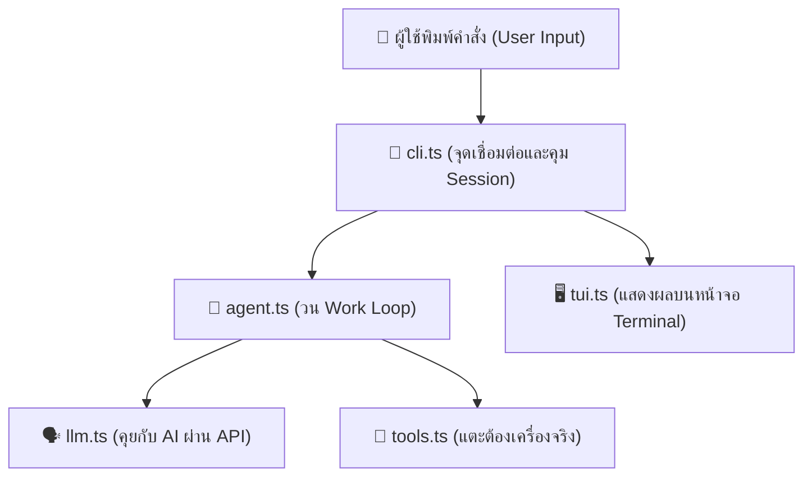
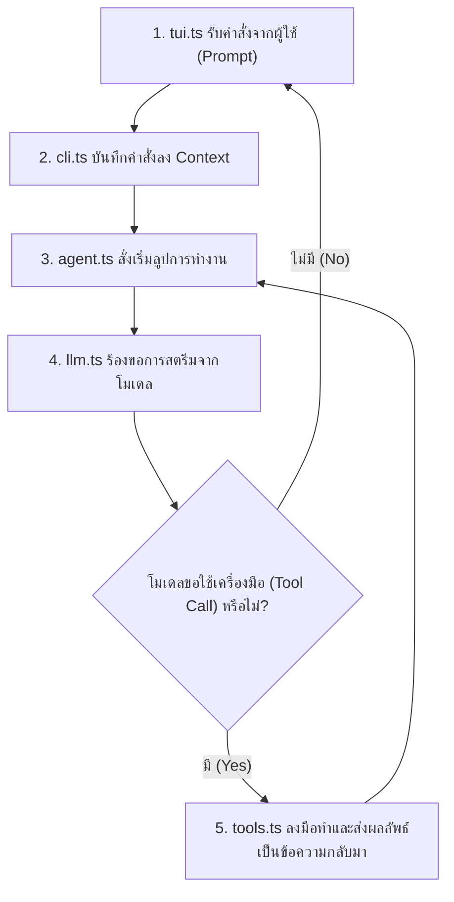

# คู่มือเรียนรู้เชิงลึก: ถอดรหัส AI Coding Assistant จากศูนย์ (Pi from Scratch · Harness Live)

> *"What I cannot create, I do not understand."* — **Richard Feynman**  
> *(สิ่งใดที่ฉันสร้างขึ้นมาเองไม่ได้ แปลว่าฉันยังไม่เข้าใจมันอย่างแท้จริง)*

บทเรียนจาก [Harness Live · Pi from Scratch](https://harness.ohmmingrath.com/) อธิบายแก่นแท้ของระบบ **AI Coding Agent** (เช่น Claude Code, Cursor, Pi, Devin) ผ่านโปรเจกต์ต้นแบบชื่อ **`nanopi`** ซึ่งเขียนด้วยภาษา TypeScript ขนาดเพียง 5 ไฟล์เล็กๆ (~929 บรรทัด) เพื่อแสดงให้เห็นว่าระบบ Agent ไม่ใช่เวทมนตร์ แต่เกิดจากการเชื่อมต่อชิ้นส่วนที่มีหน้าที่ชัดเจนเข้าด้วยกัน

---

## สารบัญเนื้อหา (Table of Contents)

1. [บทที่ 1: แผนผังระบบ 5 ชิ้นส่วนหลัก (Chapter 1: The Map)](#บทที่-1-แผนผังระบบ-5-ชิ้นส่วนหลัก-chapter-1-the-map)
   - [3 คำศัพท์พื้นฐานที่ต้องรู้ก่อนเริ่ม](#3-คำศัพท์พื้นฐานที่ต้องรู้ก่อนเริ่ม)
   - [โครงสร้างและความสัมพันธ์ของ 5 โมดูล](#โครงสร้างและความสัมพันธ์ของ-5-โมดูล)
   - [เจาะลึกหน้าที่ของแต่ละไฟล์](#เจาะลึกหน้าที่ของแต่ละไฟล์)
   - [วงจรการทำงานครบ 1 รอบ (One Complete Turn)](#วงจรการทำงานครบ-1-รอบ-one-complete-turn)
2. [บทที่ 2: สเต็ปการสร้าง nano-pi ทีละขั้นตอน (Chapter 2: Step-by-Step 23 Steps)](#บทที่-2-สเต็ปการสร้าง-nano-pi-ทีละขั้นตอน-chapter-2-step-by-step-23-steps)
3. [ตัวอย่างเปรียบเทียบเชิงลึก 5 มิติ (Comparative Analysis Matrix)](#ตัวอย่างเปรียบเทียบเชิงลึก-5-มิติ-comparative-analysis-matrix)
   - [เปรียบเทียบที่ 1: Chatbot ธรรมดา VS AI Coding Agent](#เปรียบเทียบที่-1-chatbot-ธรรมดา-vs-ai-coding-agent)
   - [เปรียบเทียบที่ 2: Pure Functions VS Impure Tools (Side Effects)](#เปรียบเทียบที่-2-pure-functions-vs-impure-tools-side-effects)
   - [เปรียบเทียบที่ 3: Normal REST Response VS SSE Streaming](#เปรียบเทียบที่-3-normal-rest-response-vs-sse-streaming)
   - [เปรียบเทียบที่ 4: Stateless Model VS Stateful Agent (Context Notebook)](#เปรียบเทียบที่-4-stateless-model-vs-stateful-agent-context-notebook)
   - [เปรียบเทียบที่ 5: nanopi (ฉบับศึกษา) VS Production Agent Frameworks](#เปรียบเทียบที่-5-nanopi-ฉบับศึกษา-vs-production-agent-frameworks)
4. [สรุปโครงสร้างไฟล์โปรเจกต์ harness บน Vercel](#สรุปโครงสร้างไฟล์โปรเจกต์-harness-บน-vercel)

---

## บทที่ 1: แผนผังระบบ 5 ชิ้นส่วนหลัก (Chapter 1: The Map)

ลองจินตนาการว่า **`nanopi`** คือ **"เวิร์กช็อปขนาดย่อม" (Tiny Workshop)** โดยแต่ละไฟล์มีหน้าที่ชัดเจน:

- **`llm.ts`**: ล่ามประจำประตูโรงงาน (The Translator) คอยคุยกับสมอง AI
- **`agent.ts`**: โฟร์แมนคุมหน้างาน (The Foreman) คอยวางแผนและสั่งช่างหยิบเครื่องมือ
- **`tools.ts`**: กล่องเครื่องมือช่าง (The Toolbox) ลงมือทำจริงบนคอมพิวเตอร์
- **`tui.ts`**: โต๊ะประชาสัมพันธ์ (The Front Desk) คอยรับคำสั่งและรายงานผลกับผู้ใช้
- **`cli.ts`**: รางปลั๊กพ่วงรวมสายไฟ (The Power Strip / Composition Root) เสียบทุกชิ้นส่วนเข้าหากัน

### 3 คำศัพท์พื้นฐานที่ต้องรู้ก่อนเริ่ม

1. **LLM (Large Language Model):**  
   สมองกลสร้างข้อความ สามารถตอบเป็นตัวหนังสือและสามารถ *"ขอเรียกใช้ชื่อเครื่องมือพร้อมพารามิเตอร์"* (Tool Call) ได้ แต่ตัว LLM เอง **ไม่สามารถ** แตะไฟล์ แก้โค้ด หรือสั่งรันคอมพิวเตอร์ของคุณได้โดยตรง
2. **Context (สมุดโน้ตประจำงาน - The Notebook):**  
   ข้อมูล JSON ที่เก็บ System Prompt, ประวัติข้อความที่คุยกัน, คำขอใช้เครื่องมือ และผลลัพธ์การรันเครื่องมือ นี่คือ *"ความทรงจำเดียว"* ของระบบ Agent
3. **Event (ใบแจ้งสถานะย่อย):**  
   ข้อความสั้นๆ แจ้งความคืบหน้าที่ถูกส่งออกมาแบบเรียลไทม์ (Streaming) ในระหว่างที่โปรแกรมกำลังทำงาน เช่น กำลังสตรีมตัวอักษร หรือกำลังรันคำสั่ง แทนที่จะต้องรอให้จบงานทั้งก้อน

### โครงสร้างและความสัมพันธ์ของ 5 โมดูล



---

### เจาะลึกหน้าที่ของแต่ละไฟล์

#### 1. `src/llm.ts` — ล่ามแปลภาษา (The Adapter / Translator)
- **ทำไมต้องมี?** โมเดลแต่ละค่าย (OpenAI, Anthropic, Gemini, Ollama) ส่งและรับข้อมูลผ่านสาย (Wire-format) แตกต่างกัน หน้าที่ของ `llm.ts` คือซ่อนความแตกต่างนี้ไว้ ไม่ให้โค้ดส่วนอื่นต้องรับรู้
- **ฟังก์ชันหลัก:** `stream(model, context, tools?, options?)` ส่ง Request ไปยัง `/chat/completions` (OpenAI-compatible) แล้วอ่านผลลัพธ์ผ่าน **SSE (Server-Sent Events)**
- **4 เหตุการณ์พื้นฐาน (StreamEvent):**
  - `text_delta`: ตัวอักษรชุดถัดไปที่โมเดลกำลังพิมพ์
  - `tool_call`: คำขอใช้เครื่องมือที่ประกอบพารามิเตอร์ครบสมบูรณ์แล้ว
  - `done`: การสตรีมสิ้นสุดลง (พร้อมเหตุผล เช่น จบปกติ หรือ โดนตัด)
  - `error`: เกิดข้อผิดพลาดทาง Network หรือ HTTP
- **จุดสำคัญทางสถาปัตยกรรม:** พารามิเตอร์ของ Tool มักถูกสตรีมมาเป็นก้อนเล็กๆ (JSON Chunks) หน้าที่ของ `llm.ts` คือต้องสะสม (Buffer) ชิ้นส่วนจนต่อกันเสร็จ แล้วค่อยส่งมอบให้ Agent เพื่อป้องกันไม่ให้ Agent ได้รับ JSON แหว่ง

#### 2. `src/agent.ts` — โฟร์แมนคุมงาน (The Loop Coordinator)
- **ทำไมต้องมี?** LLM ตอบได้ทีละครั้ง แต่การแก้โค้ดจริงต้องมีการ *"อ่านไฟล์ -> คิด -> แก้โค้ด -> รันเทสต์ -> อ่าน Error -> แก้ใหม่"* กระบวนการนี้ต้องการคนคุมลูป
- **แกนกลางคือ `while (true)`:**
  1. ส่ง Context ให้ `llm.ts` ถามว่าควรทำอะไร
  2. รับข้อความสตรีมออกมาแสดงผล
  3. ถ้าโมเดลสั่งรัน Tool -> เรียกเครื่องมือใน `tools.ts`
  4. นำผลลัพธ์การรัน (Tool Result) บันทึกกลับลงสมุดโน้ต Context
  5. วนลูปซ้ำจนกว่าโมเดลจะไม่ขอใช้ Tool อีกแล้ว
- **In-place Mutation:** ตัวแปร `context` จะถูกแก้ไขโดยตรง (in-place) ในหน่วยความจำ ไม่มีการซ่อนสเตตลับไว้ใน Agent

#### 3. `src/tools.ts` — กล่องเครื่องมือช่าง (The Toolbox)
- มี 4 เครื่องมือหลัก:
  - `read_file`: อ่านไฟล์ UTF-8 ถ้าเกิน 200 บรรทัด จะบันทึกไฟล์เต็มลง Temporary Folder ของ OS แล้วส่งเฉพาะ **200 บรรทัดท้าย** ให้โมเดลอ่าน
  - `write_file`: สั่ง `mkdir -p` สร้างโฟลเดอร์ให้อัตโนมัติ แล้วเขียนทับไฟล์เป้าหมาย
  - `edit`: ค้นหาข้อความเดิม (`old_string`) และแทนที่ด้วยข้อความใหม่ โดยบังคับว่าต้องตรงกัน **เพียง 1 จุดเท่านั้น (Uniquely match)** หากพบ 0 จุด หรือพบซ้ำหลายจุด จะปฏิเสธการแก้ทันทีเพื่อความปลอดภัย
  - `run_bash`: สั่งรันคำสั่ง Terminal Shell จริง มี Timeout 30 วินาที และมี Stop Signal (Abort) คอยดักยกเลิก
- **Impure Tools:** เครื่องมือเหล่านี้มี **Side Effects** แตะต้องฮาร์ดดิสก์จริง จึงต้องระมัดระวังเหมือนเครื่องมือช่างไฟฟ้าของจริง

#### 4. `src/tui.ts` — โต๊ะประชาสัมพันธ์ (The Front Desk)
- ดูแลหน้าจอ Terminal ด้วยโมดูล `readline` ของ Node.js
- มีระบบ **Busy State:**
  - ขณะที่ Agent กำลังคิดหรือรันคำสั่ง จะล็อกไม่ให้ผู้ใช้พิมพ์ข้อความใหม่แทรก
  - ถ้าผู้ใช้กด `Ctrl+C` ขณะที่กำลัง Busy จะส่งสัญญาณยกเลิก (Abort) ไปยัง Agent เพื่อหยุดงานอย่างนุ่มนวล
- `tui.ts` แยกขาดจาก LLM และ Tools อย่างสมบูรณ์ ไม่รู้จักโมเดล รู้จักแค่การแสดงผลข้อความ

#### 5. `src/cli.ts` — รางปลั๊กพ่วงรวมสายไฟ (Composition Root)
- จุดเดียวในโปรแกรมที่รู้ว่ามีชิ้นส่วนอะไรบ้าง (Composition Root)
- อ่านค่า Configuration: `NANOPI_API_KEY`, `NANOPI_MODEL` (ดีฟอลต์ `glm-5.2`), `NANOPI_BASE_URL`
- โหลดประวัติการคุยจาก `~/.nanopi/session.jsonl`
- เมื่อรันงานเสร็จแต่ละรอบ จะบันทึกข้อความที่เพิ่มขึ้นใหม่ต่อท้ายไฟล์ (Append-only)

---

### วงจรการทำงานครบ 1 รอบ (One Complete Turn)



> **ข้อคิดทางสถาปัตยกรรม:**  
> **Context คือสมุดโน้ต (Notebook)**, **Events คือใบแจ้งสถานะ (Status Slips)**, และ **CLI คือสายไฟเชื่อมโยง (Wiring)**  
> เพราะแต่ละส่วนแยกหน้าที่กันเด็ดขาด หากวันข้างหน้าเราต้องการเปลี่ยนหน้าจอจาก Terminal ไปเป็น Web App หรือเปลี่ยนไปใช้ค่ายโมเดลอื่น เราสามารถเปลี่ยนเฉพาะ Adapter ได้ทันที โดยไม่ต้องแก้ไข Work Loop หลักใน `agent.ts` แม้แต่บรรทัดเดียว!

---

## บทที่ 2: สเต็ปการสร้าง nano-pi ทีละขั้นตอน (Chapter 2: Step-by-Step 23 Steps)

| สเต็ป | ชื่อขั้นตอน | ไฟล์ที่เกี่ยวข้อง | คำอธิบายและประเด็นสำคัญทางเทคนิค |
| :---: | :--- | :--- | :--- |
| **01** | **Start with the loop** | `src/agent.ts` | โครงสร้าง `while (true)` แบบ `async generator` ที่ไม่มีการล็อกจำกัดรอบตายตัว หยุดเมื่อโมเดลตอบเสร็จหรือผู้ใช้สั่งยกเลิก |
| **02** | **Define the translator's data** | `src/llm.ts` | สร้าง TypeScript Types สำหรับ `Model`, `ToolDef`, `Context` (systemPrompt + messages array) โดยเป็น Plain JSON ทั้งหมด |
| **03** | **Receive the reply as a stream** | `src/llm.ts` | ฟังก์ชัน `stream()` คืนค่าเป็น `AsyncGenerator<StreamEvent>` เพื่อให้พิมพ์ข้อความไหลออกหน้าจอได้ทันที |
| **04** | **Send the request** | `src/llm.ts` | ยิง HTTP POST ไปที่ `/chat/completions` พร้อม Header Authorization และผูก `AbortSignal` เพื่อรองรับการสั่งยกเลิก |
| **05** | **Translate one update** | `src/llm.ts` | `handleSSELine()` ดึง JSON ออกจากบรรทัด `data: ` ปล่อย Text ทันที และ Buffer ชิ้นส่วนพารามิเตอร์ของ Tool เอาไว้ตาม index |
| **06** | **Read every update** | `src/llm.ts` | ใช้ `TextDecoder` แปลงไบต์ มี buffer รองรับบรรทัดที่ขาด เมื่อสตรีมจบจะ `flushToolCalls()` ปล่อย Tool Calls ทั้งหมดก่อนส่ง event `done` |
| **07** | **Convert notebook entries** | `src/llm.ts` | `contextToOpenAIMessages()` แปลงโครงสร้างภายในของ nanopi ให้ตรงตามสเปกที่ OpenAI คาดหวัง (เช่น จัด role `tool` คู่กับ `tool_use_id`) |
| **08** | **Add replies to the notebook** | `src/llm.ts` | `buildAssistantMessage()` และ `buildToolResultMessage()` ประกอบคำตอบและผลการรันกลับเข้าสู่ Context |
| **09** | **Give every tool one shape** | `src/agent.ts` | กำหนด Interface `AgentTool` (name, description, parameters ในรูป JSON Schema, execute async method) |
| **10** | **Open the toolbox** | `src/tools.ts` | สร้างไฟล์เครื่องมือ โดยเครื่องมือจะรับ Parameter และคืนค่าข้อความเท่านั้น ไม่มีสิทธิ์แตะหรือแก้ไข Context ตรงๆ |
| **11** | **Read a file** | `src/tools.ts` | `read_file` อ่านไฟล์ UTF-8 หากยาวเกิน 200 บรรทัด จะบันทึกไฟล์เต็มลง Temp และส่งเฉพาะ 200 บรรทัดท้ายสุดกลับไป |
| **12** | **Write a file** | `src/tools.ts` | `write_file` สั่งสร้างโฟลเดอร์แม่ด้วย `{ recursive: true }` แล้วเขียนทับไฟล์เป้าหมายทั้งก้อน |
| **13** | **Edit one exact passage** | `src/tools.ts` | `edit` ตรวจสอบความถูกต้องว่าพบข้อความเดิมเป๊ะๆ เพียง 1 จุดเท่านั้น หากพบ 0 หรือมากกว่า 1 จุด จะ throw error เพื่อกันแก้ผิด |
| **14** | **Run a command** | `src/tools.ts` | `run_bash` สั่งรัน shell ในเครื่อง มี Timeout 30 วินาที ถ้าคำสั่ง Error จะนำ Exit Code และ stderr ส่งกลับเป็นข้อความให้ AI คิดต่อ |
| **15** | **Define what the agent reports** | `src/agent.ts` | ประกาศ `AgentEvent` ระดับสูง 4 แบบ (`assistant_text`, `tool_call`, `tool_result`, `turn_end`) เพื่อไม่ให้หน้าจอต้องยุ่งกับ SSE |
| **16** | **Make the loop work** | `src/agent.ts` | ประกอบลูป `runAgent()` ให้รัน Tool ตามลำดับทีละตัว (Serial) รวบรวมผลลัพธ์แล้ววนลูปกลับไปถามโมเดลใหม่ |
| **17** | **Never execute truncated tool call** | `src/agent.ts` | **กฎความปลอดภัย:** เมื่อ API ส่งกลับมาว่าติด `max_tokens` ห้ามรัน Tool เด็ดขาด เพราะ JSON อาจขาด ให้ส่ง Error แจ้งโมเดลลองใหม่ |
| **18** | **Stop without leaving broken history** | `src/agent.ts` | เมื่อกด `Ctrl+C` (Abort) เครื่องมือที่ถูกข้ามจะถูกเติมผลลัพธ์ด้วย `error: aborted` เพื่อให้คู่ Message สมบูรณ์ ไม่ทำให้อนาคตพ่น HTTP 400 |
| **19** | **Treat request failure from abort** | `src/agent.ts` | ถ้าเน็ตหลุดหรือเซิร์ฟเวอร์พัง ให้บันทึกข้อความเก่าแล้วจบเทิร์นด้วย `error` ทันที ป้องกันการติด Infinite Loop |
| **20** | **Compact the notebook** | `src/agent.ts` | เมื่อประวัติครบ 50 ข้อความขึ้นไป `compactContext()` จะเก็บ 20 ข้อความล่าสุดไว้ ส่วนข้อความเก่ากว่านั้นจะส่งไปให้ AI ย่อสรุปเป็น 1 ข้อความ |
| **21** | **Add the terminal user interface** | `src/tui.ts` | สร้างคลาส `Tui` ดักอินพุตด้วย `readline` แสดงผลสตรีมมิ่ง และดัก `Ctrl+C` ตอนสถานะ `busy` |
| **22** | **Connect all five modules** | `src/cli.ts` | ผูก `Model`, `Context`, `Tools`, `Tui` เข้าหากันใน `cli.ts` จัดการ Life-cycle และรีเซ็ต `AbortController` รายเทิร์น |
| **23** | **Save the conversation** | `src/cli.ts` | บันทึกประวัติแบบ JSON Lines ลงใน `~/.nanopi/session.jsonl` แบบ Append-only เพื่อให้เปิดเครื่องใหม่แล้วทำงานต่อได้ทันที |

---


---

## บทที่ 3: Inside Pi — สถาปัตยกรรมระดับ Production (30 ขั้นตอน)

ความแตกต่างระหว่าง **`nanopi`** (ฉบับมินิมอลเพื่อการเรียนรู้) กับ **`Pi` ตัวจริง** (จาก `earendil-works/pi`) คือระบบที่รองรับการใช้งานจริงในระดับ Production ซึ่งมีรายละเอียดดังนี้:

### โครงสร้าง 5 ช่วงของ Production Agent (Phase A - E)

#### ช่วง A · เปิดเวิร์กช็อปและเตรียม Session (Steps 01 - 08)
1. **01 · CLI Entry Point:** ทางเข้าผ่าน Node CLI รับ Arguments โดยยังไม่เริ่มรันลูป
2. **02 · AgentSession Factory:** เตรียม Working Directory, Auth Services, Resource Loader, และสมุดโน้ต Session
3. **03 · Project Rules Discovery:** เดินตรวจหากฎระเบียบของโปรเจกต์ เช่น `CLAUDE.md` / `AGENTS.md` จากโฟลเดอร์แม่ลงมาโฟลเดอร์ลูก (Ancestry discovery)
4. **04 · Tool Registry:** ลงทะเบียนกล่องเครื่องมือมาตรฐาน (`read`, `write`, `edit`, `bash` + `grep`, `find`, `ls`)
5. **05 · Skill Index on Desk:** วางสารบัญ Skills ไว้บนโต๊ะ (โหลดเฉพาะ Metadata สั้นๆ ก่อน เพื่อไม่ให้เปลือง Context)
6. **06 · Standing Instructions Assembly:** รวบรวม System Prompt, Environment context, และ Rules เข้าเป็นคำสั่งหลัก
7. **07 · Session Branch Opening:** โหลดประวัติ Session ณ Branch ปัจจุบัน
8. **08 · Front Desk on Session:** เชื่อมต่อหน้าจอ (CLI TUI, RPC หรือ Web interface)

#### ช่วง B · รับคำสั่งและจัดเส้นทางงาน (Steps 09 - 12)
9. **09 · Hand message to Coordinator:** ส่งคำสั่งจากผู้ใช้เข้าสู่ `AgentSession`
10. **10 · Command & Queue Routing:** แยกแยะระหว่างข้อความปกติ, คำสั่งพิเศษ Slash Commands (`/skill`, `/compact`), และคิวข้อความ
11. **11 · Explicit Skill Expansion:** หากผู้ใช้เรียก `/skill:name` จะโหลดเนื้อหาฉบับเต็มของ Skill เข้าสู่ Context ทันที
12. **12 · Extension Hooks:** เปิดโอกาสให้ Extensions แทรก Context พิเศษก่อนรัน

#### ช่วง C · ถาม-ทำ-ถามซ้ำ (The Production Loop: Steps 13 - 23)
13. **13 · runAgentLoop:** เข้าสู่ลูปการทำงานหลักของ Class `Agent`
14. **14 · Context Packing:** ประกอบร่าง 3 สิ่ง (System instructions, Message history, Tool schemas) ส่งให้โมเดล
15. **15 · Provider Adapter Matrix:** เลือกรันผ่าน Adapter ค่ายต่างๆ (Anthropic, Gemini, OpenAI, Bedrock, Ollama)
16. **16 · Progress Streaming:** สตรีมตัวอักษรและสถานะให้ผู้ใช้เห็นความคืบหน้าแบบ Real-time
17. **17 · Work Decision:** วิเคราะห์ผลลัพธ์ว่ามี Tool Call ที่ต้องรันหรือไม่
18. **18 · Parallel Tool Scheduling:** คำนวณว่าเครื่องมือใดสามารถรันขนานกันได้ (Parallel execution) เช่น อ่านหลายไฟล์พร้อมกัน
19. **19 · Pre-execution Validation:** ตรวจสอบ Parameter ตาม JSON Schema และตรวจเช็กนโยบาย Permission ก่อนแตะเครื่อง
20. **20 · Physical Tool Execution:** ส่งต่อให้ Tool ทำงานจริง
21. **21 · Safe File Reading:** อ่านไฟล์แบบปลอดภัยพร้อมระบบ Truncate
22. **22 · Concurrency Write Queue:** ป้องกัน Race Condition ด้วยการเข้าคิวเขียนไฟล์ (Queue per file)
23. **23 · Tool Result Feedback:** บันทึกผลลัพธ์กลับเข้าสู่ Context เพื่อส่งต่อให้โมเดลในรอบถัดไป

#### ช่วง D · บันทึกประวัติแบบแตกกิ่งก้าน (Steps 24 - 26)
24. **24 · Completed Message Notebook:** เปลี่ยนข้อความที่สำเร็จเป็นบันทึกในสมุดโน้ต
25. **25 · Session Tree with parentId:** ใช้ `parentId` เชื่อมโยงข้อความ ทำให้สามารถ Undo, Fork, หรือแตกกิ่งการสนทนาได้เหมือน Git Branch
26. **26 · JSONL Storage:** บันทึกประวัติลงไฟล์ JSON Lines แบบ Append-only

#### ช่วง E · บีบอัด Context และเคลียร์สถานะ (Steps 27 - 30)
27. **27 · Boundary Context Check:** ตรวจสอบ Token Limit ณ รอยต่อระหว่างรอบ
28. **28 · Standalone Summarization Prompt:** ส่งคำสั่งพิเศษให้โมเดลสรุปประวัติเก่าๆ
29. **29 · Kept History Splicing:** รวมก้อนสรุปเข้ากับข้อความล่าสุด (Recent window) เพื่อรักษาความต่อเนื่อง
30. **30 · Settlement & Cleanup:** สิ้นสุดลูปและส่งสัญญาณ Settle เคลียร์ตัวแปรชั่วคราว พร้อมรับคำสั่งรอบถัดไป


## ตัวอย่างเปรียบเทียบเชิงลึก 5 มิติ (Comparative Analysis Matrix)

### เปรียบเทียบที่ 1: Chatbot ธรรมดา VS AI Coding Agent

| ประเด็น | Chatbot ธรรมดา (เช่น ChatGPT Web) | AI Coding Agent (เช่น nanopi, Claude Code) |
| :--- | :--- | :--- |
| **รูปแบบการทำงาน (Pattern)** | **Single-turn Request/Response**<br>ถามคำต่อคำ ถาม 1 ครั้ง ตอบ 1 ก้อนแล้วจบ | **Multi-turn Autonomous Loop**<br>วนลูปถาม-ตอบ-ลงมือทำเองจนกว่างานจะเสร็จ |
| **การเข้าถึงโลกภายนอก (Action)** | **Passive (ให้ได้แค่คำแนะนำ)**<br>ส่งโค้ดเป็นบล็อก Markdown แต่ผู้ใช้ต้องก๊อปปี้ไปแปะเอง | **Active (ลงมือแก้ในเครื่องจริง)**<br>สั่งสร้างไฟล์ แก้บรรทัดโค้ด และสั่งรันเทสต์เอง |
| **การตรวจความถูกต้อง (Verification)** | **ไม่รับรู้ผลการรัน**<br>ถ้าโค้ดมีบั๊ก ผู้ใช้ต้องเป็นคนก๊อป Error กลับมาแปะถามใหม่ | **Self-healing Feedback Loop**<br>อ่าน `stderr` ของคำสั่ง ถ้าเทสต์ไม่ผ่าน จะแก้โค้ดซ้ำจนกว่าเทสต์จะเขียว |

### เปรียบเทียบที่ 2: Pure Functions VS Impure Tools (Side Effects)

- **Pure Function (ฟังก์ชันคณิตศาสตร์บริสุทธิ์):**
  - ไม่แตะต้องฮาร์ดแวร์หรือเน็ต
  - ถ้า Input เดิม ผลลัพธ์จะเหมือนเดิม 100%
  - *ตัวอย่าง:* ฟังก์ชัน `contextToOpenAIMessages()` ใน `llm.ts` เป็น Pure Function แปลงโครงสร้างข้อมูลใน RAM
- **Impure Tool with Side Effects (เครื่องมือที่มีผลกระทบภายนอก):**
  - แตะต้องไฟล์ในฮาร์ดดิสก์ และสั่งรันกระบวนการในระบบปฏิบัติการ
  - ผลลัพธ์ขึ้นอยู่กับสภาวะภายนอก (เช่น เนื้อหาไฟล์ที่เปลี่ยนไป)
  - **ข้อควรระวังเรื่องการยกเลิก (Abort):** หากผู้ใช้กด `Ctrl+C` หลังจากคำสั่ง `write_file` หรือ `run_bash` ทำงานไปแล้ว **ไม่สามารถย้อนคืน (Undo) ได้** Side Effect ที่เกิดขึ้นแล้วจะคงอยู่ถาวร

### เปรียบเทียบที่ 3: Normal REST Response VS SSE Streaming

```
[Normal HTTP Request/Response]:
Client ------------------- POST /chat -------------------> Server
Client <---------- [รอประมวลผล 25 วินาทีนิ่งๆ] ----------> Server
Client <-------------- ส่งข้อความทั้งก้อน 4,000 tokens -- Server
(ผลลัพธ์: หน้าจอนิ่งสนิทนานมาก ผู้ใช้ไม่รู้ว่าระบบค้างหรือไม่)

[SSE Streaming]:
Client ------------------- POST /chat (stream: true) ----> Server
Client <--- data: {"delta": "หวัง"} (ที่ 350ms) ---------- Server
Client <--- data: {"delta": "ดี"} ------------------------ Server
Client <--- data: {"delta": "ครับ"} ---------------------- Server
(ผลลัพธ์: ตัวอักษรไหลออกมาทันที ผู้ใช้ตรวจสอบความถูกต้องและกดยกเลิกได้ทันที)
```

### เปรียบเทียบที่ 4: Stateless Model VS Stateful Agent (Context Notebook)

- **ความจริงเบื้องหลัง LLM:**  
  ตัวโมเดล AI บน Cloud เป็น **Stateless โดยสมบูรณ์** มันจำไม่ได้ว่าเมื่อ 5 วินาทีก่อนคุยอะไรกับใคร ทุกครั้งที่ผู้ใช้ส่งข้อความใหม่ ตัวโปรแกรม Agent ในเครื่องของเราจะต้อง **ส่งประวัติทั้งหมดตั้งแต่คำแรก** ขึ้นไปให้โมเดลอ่านใหม่เสมอ
- **สมุดโน้ต (Context) ใน `nanopi`:**
  - รอบที่ 1: ส่ง `[User: "สวัสดี ช่วยแก้บั๊กไฟล์ main.ts หน่อย"]`
  - โมเดลตอบ: ขอเรียก Tool `read_file("main.ts")`
  - เครื่องรัน: อ่านไฟล์เสร็จ ได้โค้ด 50 บรรทัด
  - รอบที่ 2: ส่ง `[User: "สวัสดี...", Assistant: "ขออ่านไฟล์...", ToolResult: "...โค้ด 50 บรรทัด..."]`
  - โมเดลตอบ: ขอเรียก Tool `edit(...)`
- **ปัญหาและทางออก:** เมื่อประวัติการคุยยาวขึ้นเรื่อยๆ จนเกินขีดจำกัด (Context Window) จึงต้องมีฟังก์ชัน **`compactContext()`** (Step 20) เพื่อตัดสรุปประวัติเก่าๆ ไม่ให้ค่า Token พุ่งสูงจนเกินขอบเขต

### เปรียบเทียบที่ 5: nanopi (ฉบับศึกษา) VS Production Agent Frameworks

| มิติ | nanopi (Teaching Agent ~900 บรรทัด) | Production Frameworks (Pi, Claude Code, Cursor) |
| :--- | :--- | :--- |
| **สถาปัตยกรรม** | โค้ดเรียบง่าย เน้นอ่านเข้าใจใน 5 ไฟล์ | โมดูลาร์ขนาดใหญ่ มี Plugin, Hooks, Sub-agents |
| **การเชื่อมต่อ LLM** | รองรับเฉพาะ OpenAI-compatible 1 ช่องทาง | มี Provider Matrix รองรับ Anthropic, Gemini, Ollama, Bedrock |
| **การรันคำสั่ง Shell** | รันบนเครื่องผู้ใช้โดยตรง ไม่มี Sandbox | มี Docker Sandbox, Allowlist, และหน้าต่างถามความยินยอมก่อนรัน |
| **การรัน Tools** | รันเรียงทีละคำสั่ง (Serial execution) | รันขนานกันได้ (Parallel execution) สำหรับงานอ่านไฟล์ |
| **การแก้ไขไฟล์** | Text substring matching (`edit`) | AST-based Refactoring และ Patching |

---

## สรุปโครงสร้างไฟล์โปรเจกต์ harness บน Vercel

โปรเจกต์นี้ได้รับการสร้างและตั้งค่าไว้ที่ไดเรกทอรี:  
📂 **`/Volumes/Sample Data/0.Vibe Code All Project/Vscode Claudecode/Harness/`**

### โครงสร้างไฟล์ภายในโปรเจกต์:
```
/Volumes/Sample Data/0.Vibe Code All Project/Vscode Claudecode/Harness/
├── index.html          # หน้าเว็บ Interactive App แบบตอบสนอง (Tailwind + Mermaid + Prism)
├── vercel.json         # การตั้งค่าสำหรับ Vercel Deployment แบบ Zero-config
├── package.json        # เมทาดาทาของโปรเจกต์ (scripts: dev, build)
├── sources.json        # โค้ด TypeScript ทั้ง 5 ไฟล์สำหรับแสดงใน Code Explorer
├── README.md           # คู่มือและคำแนะนำการใช้งาน
└── src/                # โค้ด TypeScript ฉบับจริงของ nano-pi
    ├── llm.ts          # Adapter เชื่อมต่อโมเดลและแกะ SSE Stream (~338 บรรทัด)
    ├── agent.ts        # Work Loop และระบบดักความปลอดภัย (~218 บรรทัด)
    ├── tools.ts        # 4 เครื่องมือช่าง (read, write, edit, bash) (~154 บรรทัด)
    ├── tui.ts          # Terminal UI คุม Readline และดัก Ctrl+C (~91 บรรทัด)
    └── cli.ts          # Composition Root และระบบเซฟ Session JSONL (~128 บรรทัด)
```

### การเปิดดูบนเครื่องและ Deploy:
1. **เปิดดูใน Browser บน Mac ได้ทันที:**
   ```bash
   open /Volumes/Sample Data/0.Vibe Code All Project/Vscode Claudecode/Harness/index.html
   ```
2. **Deploy ขึ้น Vercel ทันทีผ่าน Terminal:**
   ```bash
   cd /Volumes/Sample Data/0.Vibe Code All Project/Vscode Claudecode/Harness
   vercel --prod
   ```
3. **หรือ Push เข้า GitHub เพื่อเชื่อมกับ Vercel Dashboard:**  
   บนแดชบอร์ด [https://vercel.com/mrarrangers-projects](https://vercel.com/mrarrangers-projects) ให้เลือก Import Repository `harness` เพื่อรับ URL ใช้งานจริง
